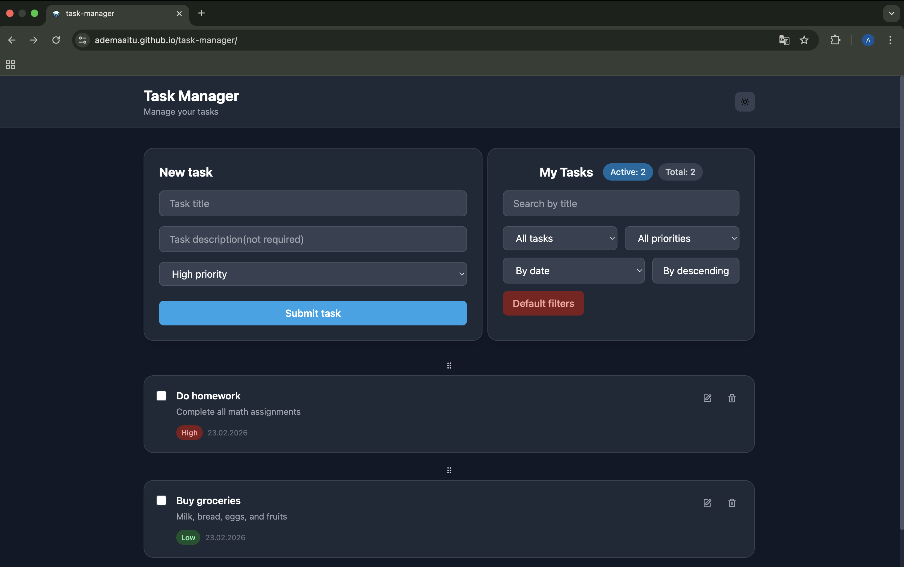
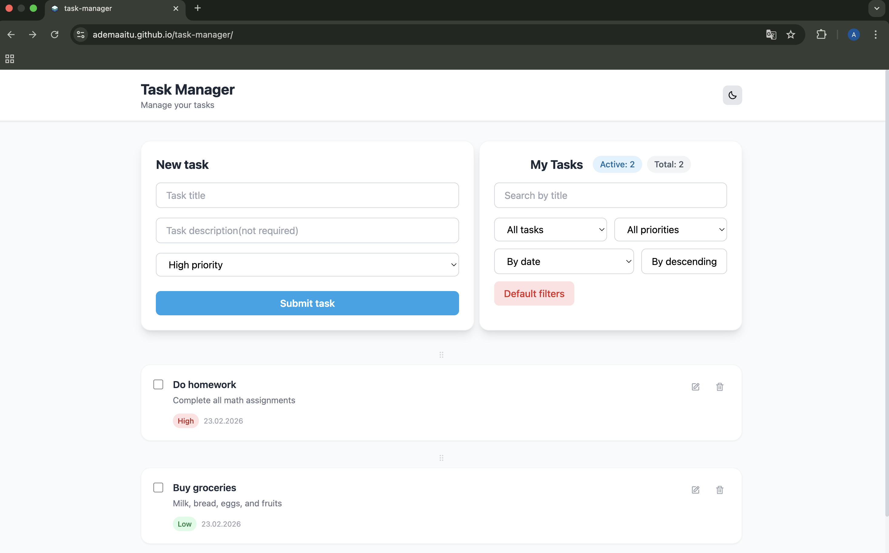

# Task Manager

Веб-приложение для управления задачами с возможностью добавления, редактирования, удаления и фильтрации задач.

## Ссылки

- [Живое приложение](https://ademaaitu.github.io/task-manager/)
- [Репозиторий](https://github.com/ademaaitu/task-manager)

## Технологии

- React 18 + TypeScript
- Zustand — управление состоянием
- Tailwind CSS — стилизация
- React Hook Form + Zod — формы и валидация
- @dnd-kit — drag & drop
- Vite — сборщик

## Функционал

- Добавление, редактирование и удаление задач
- Фильтрация по статусу и приоритету
- Поиск по названию
- Сортировка по дате, приоритету и названию
- Drag & drop для изменения порядка задач
- Тёмная и светлая тема
- Сохранение данных в LocalStorage
- Адаптивный дизайн

## Скриншоты

### Темная тема


### Светлая тема


## Запуск локально

```bash
# Клонировать репозиторий
git clone https://github.com/ademaaitu/task-manager.git

# Установить зависимости
npm install

# Запустить локально
npm run dev
```

## Деплой

```bash
npm run deploy
```
